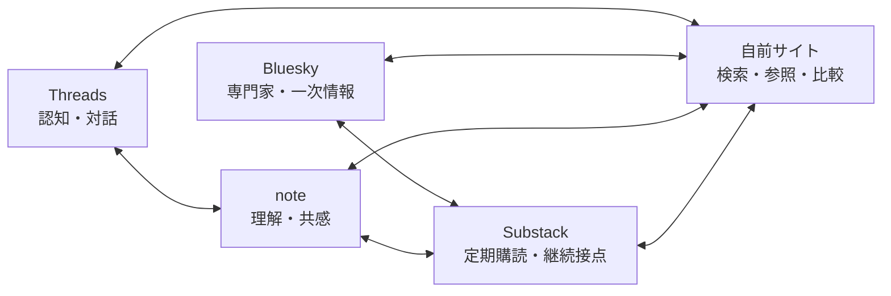
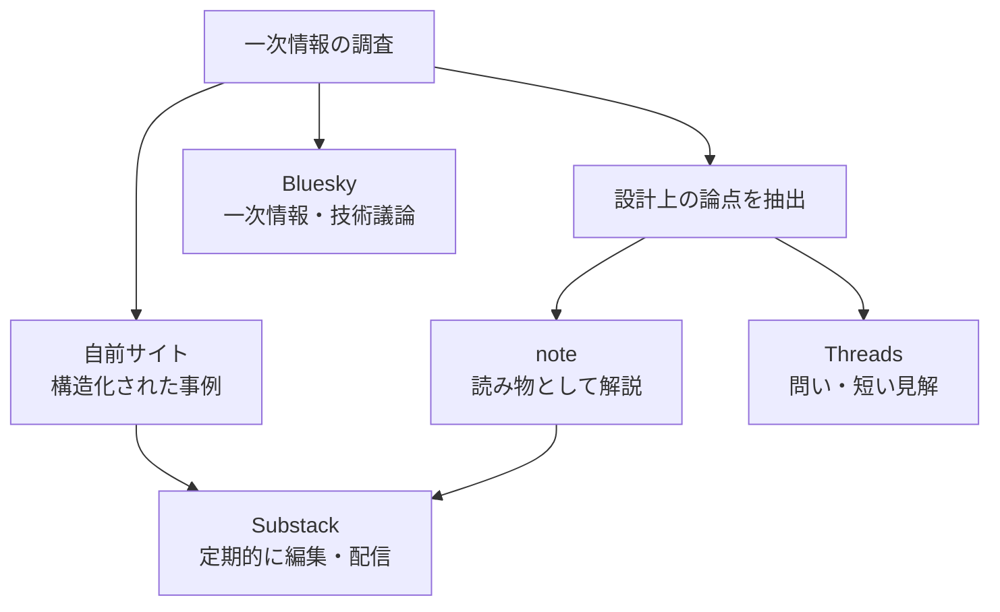

# AI Architecture Digest チャネル戦略

## 1. 文書の位置付け

本書は、AI Architecture Digest における自前サイト、note、Substack、Threads、Blueskyの役割と連携方針を定める。コンテンツの重複を避け、それぞれのチャネルで読者に固有の価値を提供しながら、GA4とBigQueryで成果を検証できる運用を目的とする。

本書の内容は運用開始前の初期戦略であり、固定的な決定ではない。投稿実績、読者の反応、計測データをもとに定期的に見直す。

## 2. 基本方針

### 2.1 媒体を上下関係だけで捉えない

自前サイトを最終終着点、外部メディアをその手前の集客チャネルとする一方向のモデルは採用しない。読者は複数の媒体を行き来し、それぞれ異なる目的で利用する。



読者体験の観点では、自前サイト、note、Substackは並列の接点である。一方、資産管理とデータ活用の観点では、自前サイトを中心基盤とする。

| 観点 | 自前サイトの位置付け |
|---|---|
| 読者との接点 | note、Substackと並列 |
| コンテンツ資産 | 構造化された知識の正本 |
| データ分析 | GA4とBigQueryによる計測の中心 |
| 読者導線 | 入口にも中継点にも到達点にもなる |
| 事業成果 | 成果そのものではなく、成果を支える基盤 |

### 2.2 最終成果は媒体への到達ではなく読者の変化

「自前サイトへ遷移したこと」だけを最終成果としない。目指す成果は、読者が次の状態になることである。

- 必要な事例や設計パターンを発見できた
- AIアーキテクチャへの理解が深まった
- 継続的に情報を受け取るようになった
- 専門メディアとして認識し、再訪するようになった
- 他の専門家との議論や協力につながった
- 将来的に問い合わせ、仕事、購入などの行動へ進んだ

読者によって適切な到達点は異なる。Substackの購読が成果になる場合もあれば、自前サイトで一件の事例を見つけて離脱することが成果になる場合もある。

### 2.3 自前サイトへの誘導を目的化しない

すべての外部投稿から自前サイトへ誘導すると、投稿単体の価値が下がり、宣伝色が強くなる。各チャネルの投稿は、その場所だけでも価値が成立することを原則とする。

投稿配分の初期目安は次のとおりとする。

- 70%: チャネル内で完結する有用な情報
- 20%: 他者との対話、引用、情報共有
- 10%: 自前サイト、note、Substackへの明確な誘導

## 3. 各チャネルの役割

### 3.1 自前サイト

**役割: 検索、参照、比較に使える知識基盤**

AIアーキテクチャの事例と設計知識を、後から再利用できる形で構造化する。単に記事を時系列で並べるのではなく、クラウド、業界、パターン、コンポーネント、成果などの軸から探索できる状態を作る。

主なコンテンツ:

- 事例カード
- 設計パターンの体系的な解説
- 複数事例の比較
- 構成図、分類、関連事例
- 長期間参照されるリファレンス
- noteやSubstackで扱ったテーマの根拠データ

読者に期待する行動:

- 必要な事例を検索・探索する
- 関連事例を回遊する
- 設計判断の材料として再訪する
- Substackを購読する
- 必要に応じて問い合わせや外部サービスへ進む

主要KPI:

- オーガニック検索流入
- 事例詳細閲覧数
- ファセット利用数
- 関連事例への遷移率
- 再訪率
- Substack登録や問い合わせへの転換

### 3.2 note

**役割: 専門的なテーマを読み物として理解・共感してもらう**

自前サイトの事例を材料にして、その背景、意味、実務への影響を一つの論点として再編集する。自前サイトの内容をそのまま転載する場所にはしない。

主なコンテンツ:

- AIアーキテクチャの背景解説
- 複数事例から見えた共通点
- 失敗例と設計上の教訓
- 初学者向けの概念解説
- 調査・制作過程で得た気づき
- 執筆者自身の判断や問題意識を含む考察

読者に期待する行動:

- 一本の記事を通してテーマを理解する
- スキ、コメント、フォローで反応する
- 関連テーマの記事を読む
- より具体的な事例が必要な場合に自前サイトを参照する
- 継続的に読みたい場合にSubstackを購読する

主要KPI:

- 記事閲覧数
- スキ、コメント、フォロー
- 記事ごとの反応率
- 自前サイトへの遷移
- Substackへの遷移
- 反応の高かったテーマ

### 3.3 Substack

**役割: 読者との継続的な接点を作る定期便**

情報を単に並べるのではなく、「今読むべきもの」を選び、短い編集コメントを付けて定期配信する。Web記事への送客だけでなく、メール内で価値が完結することも許容する。

主なコンテンツ:

- 週次または隔週の重要事例
- 新着記事の要約と選定理由
- 今週の設計上の論点
- 自前サイトの更新一覧
- noteで公開した考察の紹介
- 編集後記、次回の調査テーマ
- 将来的な購読者限定コンテンツ

基本構成:

```text
今週の重要トピック
注目事例 3件
今週の設計上の論点
自前サイト・noteの新着
編集後記
```

読者に期待する行動:

- 無料購読する
- 定期的に開封する
- 関心のある記事や事例を読む
- 必要なときに自前サイトを参照する
- 将来的に有料購読やサービス利用へ進む

主要KPI:

- 無料・有料購読者数
- 購読者増加率
- 開封率
- リンククリック率
- 購読解除率
- 継続購読率

GA4はSubstackのWebページ閲覧、登録、有料購読の計測に利用する。メール開封やメール内クリックはSubstack側の統計も併用し、GA4だけで全行動を把握しようとしない。

### 3.4 Threads

**役割: 幅広い層への認知と、対話による仮説検証**

完成済み記事の告知だけでなく、調査中に生まれた疑問や仮説を短く提示し、反応から論点を磨く。専門用語を前提としすぎず、AI活用に関心を持つ広い層にも伝わる表現を使う。

主なコンテンツ:

- 事例から得た一つの発見
- 意見が分かれそうな設計上の問い
- 3項目程度の短いまとめ
- 図表や比較結果の一部分
- ニュースへの短い見解
- note、自前サイト、Substackの更新告知

投稿例:

> AIエージェントはモデル選定より先に、失敗時の停止条件を設計したほうがよい。最近の事例を見ても、精度より運用境界の設計が成否を分けている。

読者に期待する行動:

- 投稿を読んでテーマを認知する
- 返信、引用、再投稿で議論に参加する
- プロフィールを確認する
- 興味が深まったときに詳しいコンテンツへ進む

主要KPI:

- 表示数
- 返信、引用、再投稿
- プロフィール訪問
- フォロワー増加
- リンククリック
- 投稿から記事化できたテーマ数

### 3.5 Bluesky

**役割: 技術者・専門家との情報交換と一次情報の発見**

Threadsよりも専門性を高くし、原記事、論文、OSS、仕様などの一次情報を積極的に共有する。単なる自社コンテンツの告知ではなく、情報源と技術的な観察をセットで提供する。

主なコンテンツ:

- 原記事と短い技術コメント
- アーキテクチャ上の論点
- 論文、OSS、仕様変更の共有
- 調査途中で見つけた一次情報
- 技術者への具体的な質問
- 複数投稿を使った専門的な分析
- AIアーキテクチャ関連フィードやStarter Packのキュレーション

読者に期待する行動:

- 一次情報を確認する
- 技術的な返信や補足を行う
- 専門領域を認識してフォローする
- 新しい情報源、専門家、協力者とつながる
- 必要に応じて詳細な事例や解説へ進む

主要KPI:

- 専門家からの返信
- 再投稿、引用
- 関連領域のフォロワー増加
- フィードやStarter Packへの掲載
- 新しい情報源・協力者の発見
- 自前サイトへの遷移

## 4. コンテンツ展開モデル

### 4.1 一つの調査を複数の価値に変換する

同じ文章を各媒体へ複製するのではなく、一つの調査結果をチャネルの役割に合わせて再編集する。

例として、企業向けMCPサーバーの事例を扱う場合は次のように展開する。

| チャネル | 展開内容 |
|---|---|
| 自前サイト | MCPサーバー事例カード、構成要素、パターン、類似事例 |
| note | 企業がMCPサーバーを運用するときに見落とす三つの論点 |
| Substack | 今週注目したMCP関連事例三件と選定理由 |
| Threads | 「MCPは実装より認証と監査の設計が難しい」という問い |
| Bluesky | 原記事、認証方式、監査設計への技術コメント |



### 4.2 正本の考え方

すべてのコンテンツに同一形式の正本を求めない。

- 事例データ、分類、比較情報の正本は自前サイトとする。
- 読み物としての考察はnote上で完結してもよい。
- 定期便としての編集と文脈はSubstack固有の価値とする。
- ThreadsとBlueskyの対話は、その場で生じる一次的な知見として扱う。

外部チャネルで有用な議論や知見が得られた場合は、必要に応じて自前サイトの事例・解説へ反映し、再利用可能な知識に変換する。

## 5. 読者導線

読者導線は一方向のファネルではなく、複数の入口と循環を持つ。

```text
Threadsで論点を知る
  ↓
noteで背景を理解する
  ↓
Substackを購読する
  ↓
翌週のメールから自前サイトの事例を見る
  ↓
Blueskyで専門家の議論に参加する
  ↓
別テーマのnote記事や自前サイトへ戻る
```

外部リンクは、次の行動に明確な価値がある場合に置く。

- 関連事例を比較する
- 構成図や詳細データを見る
- 今週の更新をまとめて読む
- 継続的に情報を受け取る
- 論点の背景を詳しく理解する

「詳しくはこちら」だけではなく、遷移先で得られるものをCTAに明記する。

## 6. 計測方針

### 6.1 GA4とBigQueryの役割

- GA4: 自前サイトと対応可能な外部Webページの行動計測
- BigQuery: GA4イベント、コンテンツメタデータ、チャネル実績の統合分析
- 各プラットフォームの管理画面: 開封、フォロー、反応などGA4で取得できない指標の確認

プラットフォーム内の全行動をGA4で取得できるとは考えない。GA4のデータと、各チャネルが提供する分析値を分けて扱う。

### 6.2 UTM命名

外部チャネルから自前サイトなどへリンクする場合は、最低限次の値を付与する。

| パラメータ | 値の例 | 用途 |
|---|---|---|
| `utm_source` | `note`, `substack`, `threads`, `bluesky` | 流入チャネル |
| `utm_medium` | `article`, `newsletter`, `social` | 配信形式 |
| `utm_campaign` | `weekly_digest_2026_30`, `mcp_series` | 企画または配信単位 |
| `utm_content` | `article_footer`, `post_01`, `case_aws_mcp` | リンク位置・投稿識別 |

例:

```text
https://example.com/cases/aws-mcp
  ?utm_source=substack
  &utm_medium=newsletter
  &utm_campaign=weekly_digest_2026_30
  &utm_content=case_aws_mcp
```

値は小文字のASCIIとスネークケースを基本とし、投稿ごとに表記を変えない。

### 6.3 自前サイトの主要イベント候補

| イベント | 意味 |
|---|---|
| `view_case` | 事例詳細の閲覧 |
| `select_facet` | 分類軸の選択 |
| `view_related_case` | 類似事例への遷移 |
| `click_source` | 原記事への遷移 |
| `click_channel` | note、Substack、SNSへの遷移 |
| `newsletter_signup` | ニュースレター登録完了 |
| `contact_submit` | 問い合わせ完了 |

イベントには可能な範囲で `content_id`、`content_type`、`patterns`、`cloud`、`published_at`、`cta_id` を付与し、コンテンツ特性と成果を結び付ける。

## 7. 初期運用案

無理なく継続できる最小構成として、次を初期案とする。

| 頻度 | チャネル | 内容 |
|---|---|---|
| 随時 | 自前サイト | 収集した事例カードを追加 |
| 月2本 | note | 複数事例を材料にした解説・考察 |
| 週1回または隔週 | Substack | 注目事例と編集コメントの定期便 |
| 週3回程度 | Threads | 問い、短い見解、一般向けの発見 |
| 週3回程度 | Bluesky | 一次情報、技術コメント、専門家との対話 |

一つの調査から最低一つの事例カードを作り、必要に応じてnote、Substack、SNSへ展開する。すべての調査を全チャネルへ展開することは要件にしない。

## 8. 見直し方法

月次で次の観点を確認する。

1. どのテーマが各チャネルで反応されたか。
2. 各チャネルからどのコンテンツへ遷移したか。
3. 自前サイトで回遊・再訪・購読につながったテーマは何か。
4. 投稿作成に要した時間に対して成果が見合っているか。
5. 各チャネル固有の価値を提供できているか。
6. 投稿の重複や過剰な外部誘導が発生していないか。

3か月ごとに、投稿頻度、テーマ、CTA、KPIを見直す。フォロワー数やPVだけで判断せず、専門家との接点、再訪、購読継続、コンテンツ制作への学習効果も評価する。

## 9. 現時点の役割定義

各チャネルの役割を一文で定義する。

- **自前サイト**: AIアーキテクチャを調査・比較する人に、再利用可能な事例と設計知識を提供する。
- **note**: AIアーキテクチャに関心を持つ読者に、事例の背景と実務上の意味を読み物として伝える。
- **Substack**: 最新動向を継続的に追いたい読者に、重要な事例と編集された視点を定期的に届ける。
- **Threads**: 幅広いAI関心層に短い論点を提示し、対話を通じて関心と仮説を確かめる。
- **Bluesky**: 技術者・専門家と一次情報や技術的な観察を交換し、調査ネットワークを形成する。

この定義を、投稿テーマを選ぶ際の判断基準とする。

## 10. 参考情報

媒体仕様は変更される可能性があるため、実装・運用開始時に公式情報を再確認する。

- [Substack: GA4連携](https://support.substack.com/hc/en-us/articles/15955098199444-How-do-I-connect-Google-Analytics-4-to-my-Substack-publication)
- [Substack: Notes](https://support.substack.com/hc/en-us/articles/14564821756308-Getting-started-on-Substack-Notes)
- [Threads: Insightsとリンク機能](https://about.fb.com/news/2025/03/new-threads-features-more-personalized-experience-you-control/)
- [Bluesky: カスタムフィード](https://bsky.social/about/blog/7-27-2023-custom-feeds)
- [Bluesky: Starter Pack](https://bsky.social/about/blog/06-26-2024-starter-packs)
- [Google Analytics: BigQuery Export](https://support.google.com/analytics/answer/9358801)
