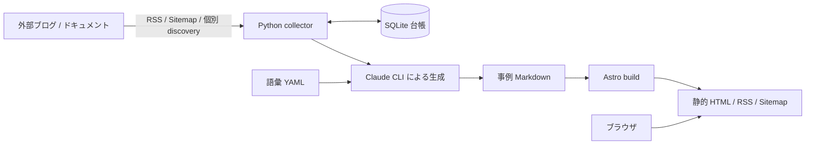
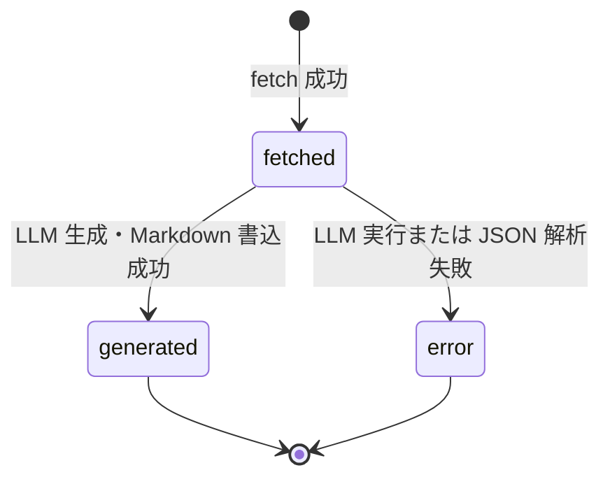
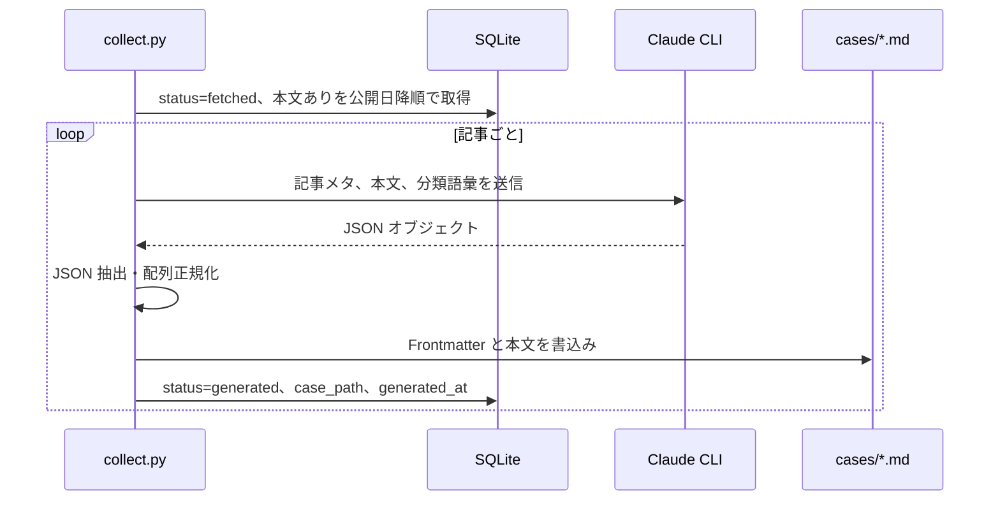

# AI Architecture Digest 設計書

## 1. 文書概要

### 1.1 目的

本書は `ai-architecture-digest` の現行実装を基準に、システムの目的、構成、データモデル、主要処理、画面・URL、運用方法、および制約を整理する。実装変更時の影響確認と、収集対象・コンテンツ・公開機能を拡張する際の共通資料として使用する。

### 1.2 対象範囲

- Astro による事例カタログの静的サイト生成
- Markdown で管理する事例コンテンツ
- Python による外部記事の取得、SQLite 台帳管理、Claude CLI を用いた事例生成
- ファセット別ページ、事例詳細、RSS、サイトマップ

以下は現時点では対象外、または未実装である。

- ユーザー認証、投稿、管理画面
- サーバーサイド API、動的検索、データベースを使った公開時クエリ
- 自動スケジュール実行

## 2. システム概要

本システムは、AI アーキテクチャに関する外部記事を収集し、日本語の事例カードに再構成して、複数の切り口から参照できる静的カタログとして公開する。

設計上は次の二つのサブシステムに分かれる。

1. **収集・生成サブシステム**: 外部ソースから記事を取得し、SQLite で処理状態を管理しながら Markdown を生成するローカルバッチ。
2. **閲覧サブシステム**: Markdown を Astro Content Collection で検証・読み込みし、一覧、詳細、ファセット、RSS を静的生成する Web サイト。



公開サイトはビルド時にすべてのコンテンツと URL を確定する。SQLite は収集処理専用であり、公開成果物や閲覧処理からは参照しない。

## 3. 技術構成

| 区分 | 技術 | 用途 |
|---|---|---|
| フロントエンド / SSG | Astro 5 | ページ、コンポーネント、静的ルート生成 |
| コンテンツ | Markdown + YAML Frontmatter | 1 ファイル 1 エントリの事例管理 |
| スキーマ | Astro Content Collections + Zod | ビルド時の Frontmatter 検証・正規化 |
| フィード | `@astrojs/rss` | RSS 2.0 の生成 |
| サイトマップ | `@astrojs/sitemap` | 静的 URL のサイトマップ生成 |
| 収集バッチ | Python 3 | RSS・サイトマップ・HTML の取得と整形 |
| HTML 解析 | Beautiful Soup 4 | 記事本文、タイトルの抽出 |
| 設定解析 | PyYAML | 追跡ソース、語彙、Frontmatter の読み書き |
| 状態管理 | SQLite | 記事単位の取得・生成状態と重複防止 |
| コンテンツ生成 | Claude CLI (`claude -p`) | 記事本文から日本語事例カードを生成 |

Node.js 依存関係は `package-lock.json` で固定する。Python 依存関係を固定する requirements ファイルは現状存在しないため、実行環境側で `PyYAML` と `beautifulsoup4` を用意する必要がある。

## 4. ディレクトリ構成

| パス | 責務 |
|---|---|
| `src/content/cases/` | 公開対象となる事例 Markdown |
| `src/content.config.ts` | Content Collection のスキーマ |
| `src/lib/facets.ts` | 事例取得、slug、URL、ファセット、類似度の共通処理 |
| `src/layouts/Base.astro` | 全ページ共通レイアウト、ナビゲーション、スタイル |
| `src/components/CaseRow.astro` | 一覧用の事例行 |
| `src/pages/` | ファイルベースルーティングと静的ページ生成 |
| `scripts/collect.py` | 収集、生成、台帳確認の CLI |
| `scripts/.cache/collect.db` | ローカル SQLite 台帳。Git 管理対象外 |
| `sources.yml` | 追跡対象ソースと取得方式の定義 |
| `vocab/` | 生成時に候補として与える分類語彙 |
| `astro.config.mjs` | サイト URL、base path、サイトマップ設定 |
| `dist/` | Astro のビルド成果物。Git 管理対象外 |

## 5. データ設計

### 5.1 公開コンテンツ

事例の正本は `src/content/cases/<id>.md` とする。ファイル名の拡張子を除いた値が Content Collection の `entry.id` となり、事例詳細 URL に使われる。

Frontmatter の定義は次のとおりである。

| 項目 | 型 | 必須 | 説明 |
|---|---|---:|---|
| `type` | enum | 必須 | `case`, `guidance`, `opinion`, `announcement` |
| `title` | string | 必須 | 日本語の再構成タイトル |
| `title_original` | string | 任意 | 元記事タイトル |
| `company` | string | 任意 | 実装主体。クラウド事業者とは区別する |
| `industry` | string | 任意 | 業界分類 |
| `cloud` | string[] | 省略可 | クラウド分類。省略時は空配列 |
| `patterns` | string[] | 省略可 | アーキテクチャパターン。省略時は空配列 |
| `components` | string[] | 省略可 | 製品、サービス、技術要素。省略時は空配列 |
| `data_sources` | string[] | 省略可 | 扱うデータ種別。自由記述。省略時は空配列 |
| `outcome.type` | string | 任意 | 主な成果分類 |
| `source_id` | string | 任意 | `sources.yml` のソース ID |
| `source_name` | string | 任意 | 出典の表示名 |
| `source_url` | URL string | 必須 | 原記事 URL |
| `published_at` | string / Date | 必須 | 公開日。読み込み時に `YYYY-MM-DD` へ正規化 |

本文は原則として `概要`、`設計のポイント`、`使いどころ` の三つの H2 セクションで構成する。スキーマは本文の見出し構成までは検証しない。

### 5.2 語彙

`vocab/*.yml` は LLM に分類候補を提示し、表記揺れを抑えるために使用する。現在の生成処理が読み込むのは `patterns`、`cloud`、`industries`、`outcomes`、`types` である。`components.yml` は管理されているが、現行の生成プロンプトには読み込まれず、技術要素は記事から自由に生成される。

Content Collection 側は、`type` 以外の値が語彙に含まれるかを検証しない。したがって新語を許容できる一方、表記統制は生成プロンプトとレビューに依存する。

### 5.3 収集台帳

SQLite の `articles` テーブルが収集処理の状態を保持する。

| カラム | 制約 / 用途 |
|---|---|
| `id` | 主キー。`<source_id>-<title slug 先頭60文字>` |
| `url` | UNIQUE、原記事 URL。主要な重複判定キー |
| `source_id`, `source_name`, `tier` | 取得元メタデータ |
| `title`, `published`, `text`, `vendors` | 取得した記事情報 |
| `status` | `fetched`, `generated`, `error` |
| `case_path` | 生成した Markdown の相対パス |
| `fetched_at`, `generated_at` | UTC ISO 8601 の処理日時 |
| `error` | 生成失敗内容。最大 300 文字を保存 |

`status` と `source_id` に索引を持つ。DB 初期化時には既存 Markdown の `source_url` を読み取り、台帳に存在しないものを `generated` として逆輸入する。これによりローカル DB を削除しても、コミット済み事例の重複生成を防ぐ。



現行実装には `error` から `fetched` へ戻す再試行コマンドはない。再試行する場合は台帳の状態を運用者が修正するか、実装を追加する必要がある。

## 6. 収集・生成処理

### 6.1 コマンド

```bash
python scripts/collect.py fetch [--source ID] [--limit N] [--max-fetch M] [--dry-run]
python scripts/collect.py generate [--limit N] [--dry-run]
python scripts/collect.py status
python scripts/collect.py run [--source ID] [--limit N] [--max-fetch M] [--dry-run]
```

- `fetch`: 対象記事を検出し、本文を抽出して `fetched` として台帳へ登録する。
- `generate`: 本文がある `fetched` 記事を新しい順に Claude CLI へ渡し、Markdown を生成する。
- `status`: status 別・source 別の件数を表示する。
- `run`: `fetch` と `generate` を順番に実行する。

`--limit` は RSS ではフィードから処理する上限、非 RSS では本文取得後に登録する上限である。非 RSS の `--max-fetch` は、未知 URL に対して本文取得を試みる上限であり、通信量を抑える役割を持つ。

### 6.2 取得方式

| 方式 | 処理 |
|---|---|
| `rss` | RSS / Atom を標準 XML パーサーで解析し、各記事ページから本文を抽出 |
| `sitemap` | ソース固有の discovery 関数で URL を列挙し、記事ページを取得 |
| `page-diff` | 対象一覧ページから記事 URL を抽出 |
| `internal-api` | AWS Architecture Center の検索 API からメタデータを取得 |
| `manual` | 自動取得せずスキップ |

非 RSS の自動取得は `DISCOVERERS` に登録されたソースだけが対象となる。`sources.yml` に方式を追加しただけでは自動取得されない場合がある。

HTML 抽出時は `script`、`style`、`nav`、`header`、`footer`、`aside`、`form` を除外し、`main`、`article`、`body` の優先順で本文を採用する。本文は最大 8,000 文字、生成プロンプトへの入力は最大 7,000 文字である。公開日は JSON-LD、本文中の英語日付などから補完する。

### 6.3 生成処理



LLM は記事種別、タイトル、分類、要約、設計上の要点、利用場面を JSON で返す。生成結果の配列項目は正規化し、公開日を抽出できなかった場合は `fetched_at` の日付へフォールバックする。LLM 実行または JSON 解析に失敗した記事は `error` とし、他の記事の処理は継続する。

収集失敗は原則として標準エラーへ記録してその記事またはソースをスキップする。通信は User-Agent を指定し、既定 30 秒、Claude CLI は 180 秒のタイムアウトを持つ。

## 7. 閲覧・静的生成処理

### 7.1 ビルドフロー

1. Astro が `src/content/cases/**/*.md` を読み込む。
2. Content Collection の Zod スキーマで Frontmatter を検証・正規化する。
3. `allCases()` が全事例を `published_at` の降順に並べる。
4. 動的ルートの `getStaticPaths()` が事例 ID および各ファセット値から URL を列挙する。
5. Astro が HTML、RSS、サイトマップを `dist/` に出力する。

不正な必須項目、列挙外の `type`、不正な `source_url` がある場合はビルド時に検出される。

### 7.2 URL 設計

| URL | 内容 | 生成方法 |
|---|---|---|
| `/` | 公開日降順の全事例。種別フィルター付き | 固定ページ |
| `/explore/` | 全ファセットと件数 | 固定ページ |
| `/cases/<id>/` | 事例本文、タグ、出典、類似事例 | 事例ごとの静的生成 |
| `/cloud/<slug>/` | クラウド別一覧 | 値ごとの静的生成 |
| `/patterns/<slug>/` | パターン別一覧 | 値ごとの静的生成 |
| `/industries/<slug>/` | 業界別一覧 | 値ごとの静的生成 |
| `/components/<slug>/` | 技術スタック別一覧 | 値ごとの静的生成 |
| `/companies/<slug>/` | 企業別一覧 | 値ごとの静的生成 |
| `/outcomes/<slug>/` | 成果別一覧 | 値ごとの静的生成 |
| `/data-sources/<slug>/` | データ種別別一覧 | 値ごとの静的生成 |
| `/rss.xml` | 全事例の RSS | リクエストハンドラを静的出力 |
| `/sitemap-*.xml` | サイトマップ | Astro integration |

内部リンクは `url()` を経由し、Astro の `BASE_URL` を付与する。GitHub Project Pages で公開する場合は、`astro.config.mjs` の `base` を `/ai-architecture-digest` に変更する想定である。現行値はローカル確認向けの `/` である。

### 7.3 slug 規則

ファセット値は次の規則で slug 化する。

1. 小文字化し、前後空白を除去する。
2. ASCII 英数字以外の連続を `-` に置換する。
3. 先頭・末尾の `-` を除去する。
4. 空になった場合は `item` とする。

同じ slug へ正規化された複数の表示値は、最初に現れたラベルのページへ統合される。日本語だけの値も `item` になるため、自由語彙の追加時には slug 衝突を確認する必要がある。

### 7.4 ファセットと類似事例

ファセット一覧は各事例から対象値を抽出し、slug ごとに件数と事例を集約する。探索ページでは件数降順、各ファセットページ内では元の `allCases()` の順序、すなわち公開日降順を維持する。

類似事例は `cloud`、`patterns`、`components`、`data_sources`、`industry` を名前空間付きタグへ変換し、Jaccard 係数 `共通タグ数 / 和集合タグ数` で評価する。共通タグが一つ以上ある候補をスコア降順で最大 3 件表示する。現行コードのコメントでは「重み付き」とされているが、実装上はすべてのタグが同じ重みである。

### 7.5 クライアント側動作

トップページの種別フィルターのみブラウザ JavaScript を使用する。ボタン操作に応じて該当しない行の `display` を切り替えるだけで、URL、履歴、サーバー状態は変更しない。他の主要画面は JavaScript なしで閲覧できる。

## 8. UI 設計

- 共通ヘッダーにはサイト名、件数上位 9 件のパターンタブ、探索ページへのリンクを表示する。
- 一覧行にはクラウドまたはソースを示すサムネイル、種別、タイトル、出典情報、本文抜粋、主要タグを表示する。
- 公開日から 14 日未満のエントリには `New!` を付ける。この判定には Astro コンポーネント生成時の `Date.now()` を使うため、静的サイトではビルド時刻を基準とする。
- 詳細ページでは本文、原記事リンク、全ファセット、類似事例を表示する。
- 620px 以下ではサムネイルとタイトルを縮小し、狭い画面に対応する。
- 画像アセットは使用せず、クラウド別の CSS 背景を一覧の識別要素とする。

アクセシビリティ上、ページは見出し構造と通常のリンクを中心に構成される。一方、種別フィルターの選択状態は class のみで、`aria-pressed` 等は現状付与していない。

## 9. 非機能設計

### 9.1 性能・拡張性

- 公開側は静的ファイルのみのため、実行時 DB やアプリケーションサーバーを必要としない。
- ビルド時は全事例を複数ページで読み込み、ファセット値ごとにページを生成する。事例・語彙が大幅に増えた場合、ビルド時間と生成ファイル数が増える。
- 類似度計算は各詳細ページで全件との比較を行うため、概ね事例数の二乗に比例してビルドコストが増える。
- 収集処理は逐次実行であり、外部サイトへの負荷と LLM コストを `limit` で制御する。

### 9.2 可用性・障害分離

- 外部ソース障害は収集時に当該ソースをスキップし、既存の公開コンテンツには影響しない。
- 1 記事の LLM 生成失敗は `error` として記録し、後続記事の処理を継続する。
- Markdown のスキーマ違反はビルドを失敗させ、不正コンテンツの公開を防ぐ。
- SQLite と `dist/` は再生成可能なローカルデータとして Git 管理しない。公開コンテンツの復元元は Git 管理された Markdown である。

### 9.3 セキュリティ・権利

- 収集対象 URL は `sources.yml` とソース固有 discovery で決まるが、取得先の厳密な allowlist 検証は実装していない。
- 外部 HTML はテキスト化して LLM へ渡し、公開本文にはそのまま埋め込まない。
- LLM 出力の本文は Markdown としてレンダリングされるため、コンテンツ追加後は内容とリンクをレビューする。
- 原記事リンクは別タブで開き、`rel="noopener"` を指定する。
- API キーはリポジトリに保持せず、Claude CLI のローカル認証を利用する。
- 要約は二次コンテンツであることと、出典への帰属をフッターで表示する。
- 取得と二次利用では、各サイトの利用条件、robots.txt、著作権を運用者が確認する。`manual` 指定のソースは自動取得しない。

### 9.4 観測性

- 収集処理は進捗と失敗を標準エラーへ出力する。
- `status` コマンドで台帳の status 別・source 別件数を確認できる。
- GA4でページ閲覧を計測し、BigQueryへの日次Exportを設定している。
- 構造化ログ、アプリケーションメトリクス、通知は未実装である。

## 10. 開発・運用

### 10.1 公開サイト

```bash
npm install
npm run dev
npm run build
npm run preview
```

`npm run build` の成功を、Content Collection、全静的ルート、RSS、サイトマップの最低限の整合性確認とする。ビルド成果物は `dist/` に生成される。

### 10.2 コンテンツ更新

推奨する更新手順は次のとおりである。

1. `fetch` を少数の `--limit` または特定の `--source` で実行する。
2. `status` で取得件数を確認する。
3. `generate --limit N` で Markdown を生成する。
4. 生成されたタイトル、分類、要約、出典 URL、公開日を人手でレビューする。
5. `npm run build` を実行する。
6. 差分を確認し、Markdown と必要な語彙変更を Git へ記録する。

`--dry-run` は候補確認用であり、`fetch` では DB 登録と本文取得後の書き込みを抑止し、`generate` では LLM 呼び出しとファイル生成を行わない。

### 10.3 ソース追加

1. `sources.yml` に一意な `id`、表示名、tier、priority、method、URL、vendors を追加する。
2. RSS 以外の場合、必要に応じて `scripts/collect.py` に discovery 関数を実装し、`DISCOVERERS` に登録する。
3. `fetch --source <id> --dry-run` で候補と抽出品質を確認する。
4. 少数件を取得・生成し、日付、タイトル、本文抽出を確認する。

## 11. テスト方針

現状、自動テストスイートは存在しない。変更時には少なくとも次を確認する。

| 対象 | 確認内容 |
|---|---|
| コンテンツスキーマ | 正常 Markdown のビルド成功、必須項目・URL・type 不正時の失敗 |
| slug / URL | base path、記号・日本語・衝突候補の変換 |
| ファセット | 値ごとの件数、空値除外、複数値を持つ事例の所属 |
| 類似事例 | 自分自身の除外、共通タグなしの除外、上位 3 件 |
| RSS | 日付順、リンク、抜粋、不正日付による全体失敗の防止 |
| 収集 | RSS / Atom 解析、既知 URL のスキップ、日付抽出、dry-run |
| 生成 | JSON コードフェンス除去、配列正規化、エラー状態、日付フォールバック |
| 表示 | トップの種別フィルター、詳細から各ファセットへの遷移、モバイル幅 |

収集処理を自動テストする場合は、外部ネットワークと Claude CLI を直接使わず、フィード、HTML、LLM 応答を fixture またはモックへ置き換える。

## 12. 既知の制約と改善候補

優先度順ではなく、現行設計上の論点として列挙する。

- Python 依存関係がファイルで固定されておらず、環境再現性が限定的である。
- `error` 記事の再試行、台帳の修復、生成済み記事の再生成を行う CLI がない。
- LLM 出力は JSON と一部の型だけを補正し、Content Collection と同等のスキーマ検証を生成直後には行わない。
- 語彙と Content Collection の値を照合しないため、表記揺れや slug 衝突をビルドで検出できない。
- 日本語のみのファセット値は `item` に正規化され、複数値が衝突する可能性がある。
- 類似度は全タグ同一重みで、同点時の明示的な安定ソート条件がない。
- 自動テスト、定期収集、監視が未実装である。
- `sources.yml` の `tier`、`priority`、`vendors` は台帳または取得情報として保持されるが、公開ページの並び順や絞り込みには使われない。
- GA4は既定の自動収集が中心であり、ファセット選択や外部リンククリックなどのカスタムイベントは未実装である。

## 13. 設計上の変更ルール

- 公開データの契約を変更する場合は、`src/content.config.ts`、生成プロンプト、`write_case()`、既存 Markdown、表示側を一組として更新する。
- ファセットを追加する場合は、アクセサー、探索ページ、静的ルート、詳細タグ、必要に応じて語彙と生成プロンプトを更新する。
- URL を変更する場合は、`BASE_URL` 対応、RSS、サイトマップ、既存外部リンクへの影響を確認する。
- 収集方式を追加する場合は、取得件数の上限、タイムアウト、重複判定、対象外 URL、失敗時の継続方法を定義する。
- LLM 生成結果は公開前に人手レビューを行い、原記事にない断定、誤分類、日付・企業名の誤りを確認する。
